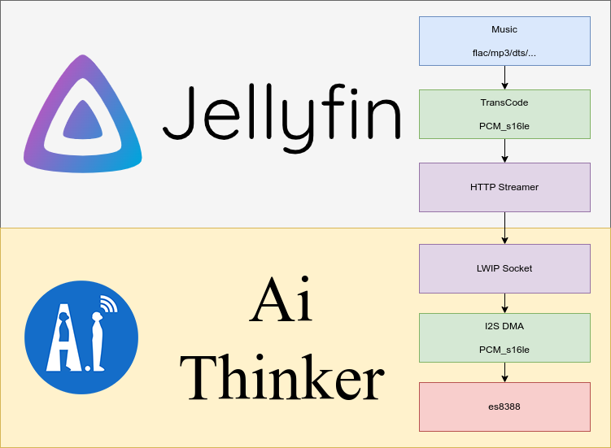

# AIPI-eyes-s1 Jellyfin Play demo

> WARNING  
> 这仅仅是一个尝试，不是完整的产品，后续维护的可能性不大

> 小安派体验活动：
> 活动白拿的开发板 :)  
> 两天多的时间主要体会下博流的芯片  
> 芯片性能不错，但是软件生态还需要时间发展

## Known Issues

> 鲁迅：遇到的绝大多数问题都可以重启解决

- HTTP
  - 没看懂mbedtls，拿socket当HTTP用了，但是很多地方解码都是凑活能用
  - 配合cJSON经常死机，一般可以重启解决 😄
  - 有些地方内存申请了，没释放（因为完善的内存管理比较花时间...）
  - 错误处理也没有
  - 没有任何缓冲策略，包括音乐播放，均是收到一包播放一包
- UI
  - lvgl设计很好，但是squareline有点用不来，特别是动态生成页面根本不知道该怎么点...
  - 拿脚写的lvgl，以凑合能用为主，经常死机，死机的话重启几次总有一次能进去
  - 不支持中日韩字体
  - 每次重启都要登录，没研究flash操作
  - 登录码超时后不会重新申请，请重启
- 杂音
  - 小爆破音
    杂音问题主要来自HTTP解码的问题，因为使用socket直接接收HTTP数据，没有对HTTP标记进行处理，这些标记播放出来会出现噪声
  - 噪声（类似于收音机没有台）
    同样是HTTP解码的问题，导致16bit的I2S数据高低位错误
- Jellyfin
  - 需要 https://github.com/jellyfin/jellyfin/pull/10321 才可以支持PCM解码，PR合并前需要自己编译

## 调试笔记

[在这里](https://feilong.home.blog/2023/10/03/aipi-eyes-s1-%e8%b0%83%e8%af%95%e7%ac%94%e8%ae%b0/)

## 吐槽

- 官方文档
  - 博流的文档和其他厂商还有一定差距，隐藏寄存器过多，出现问题很难从手册找出问题
  - GLB这种影响系统的寄存器被大量隐藏，导致系统实现有些难以理解
- 软件生态
  - 和espressif有差距，比如音频解码器
  - 目前貌似只能配合freeRTOS使用，baremetal的话由于隐藏寄存器，出现问题难以查找

## 图

### 开机

### 登录码

### Lib

### 列表

### 演示视频

正在做...
